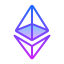

<!--
**blaze00193/blaze00193** is a ✨ _special_ ✨ repository because its `README.md` (this file) appears on your GitHub profile.

Here are some ideas to get you started:

- 🔭 I’m currently working on ...
- 🌱 I’m currently learning ...
- 👯 I’m looking to collaborate on ...
- 🤔 I’m looking for help with ...
- 💬 Ask me about ...
- 📫 How to reach me: ...
- 😄 Pronouns: ...
- ⚡ Fun fact: ...
-->

 I'm Full Stack & Smart contract Dev. 

## ⚡My Skills⚡

  <kbd style="padding: 15px;">
    
Blockchain

    
    
    
    
    
  </kbd>
  <kbd style="padding: 15px;">
    
Frontend

     
     
     
    
    
  </kbd>
  <kbd style="padding: 15px;">
    
Backend

    
    
    
  </kbd>
  <kbd style="padding: 15px;">
    
Database

    
    
    
  </kbd>
  <kbd style="padding: 15px;">
    
Library/FrameWorks

    
    
    
    
    
    
    
    
    
    
  </kbd>
  <kbd style="padding: 15px;">
    
Tools

    
    
    
    
  </kbd>
  <kbd>
    
OS

    
    
    
    
  </kbd>

<!--  -->
## 😎GitHub Status😎

  

